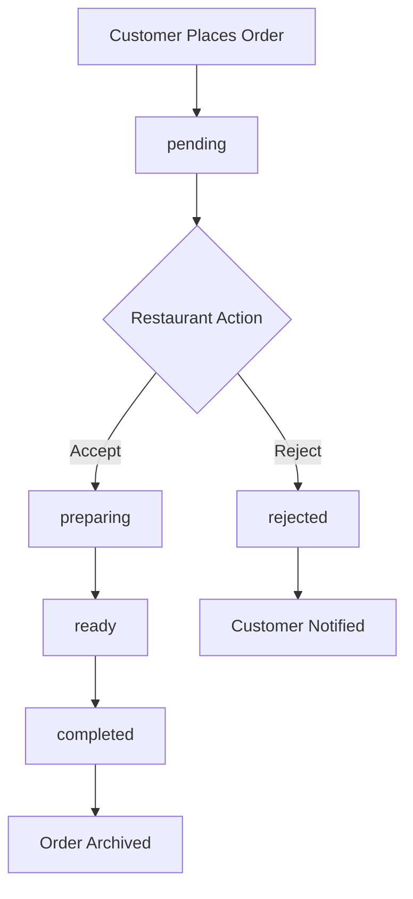
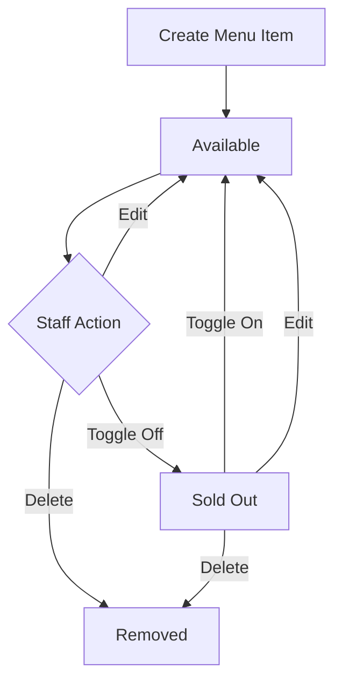
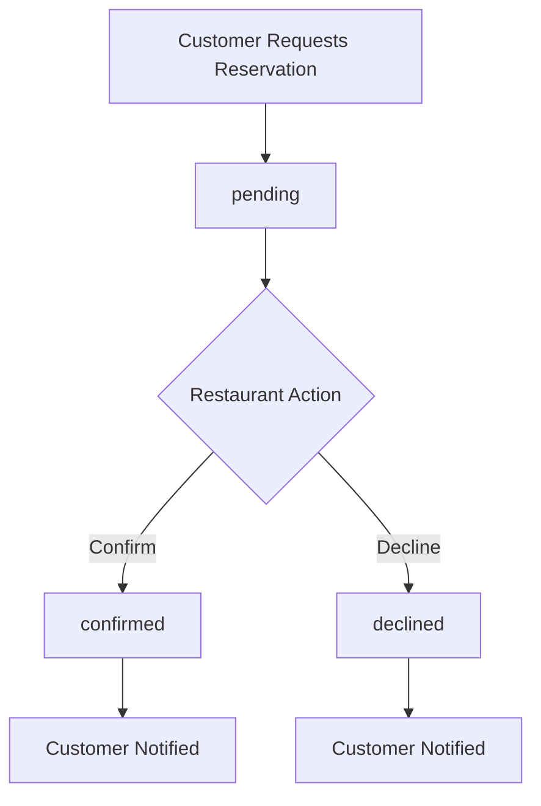

# **Business Rules Specification: Mobilify Pro Admin Panel**

**Document Version:** 1.0  
**Date:** July 25, 2025  
**Purpose:** Detailed business logic and workflow specifications for implementation

---

## **1. Order Management Workflow**

### **1.1 Order Status Lifecycle**



### **1.2 Order Status Definitions**

| Status        | Description                            | Available Actions | Business Rules                            |
| ------------- | -------------------------------------- | ----------------- | ----------------------------------------- |
| **pending**   | New order awaiting restaurant response | Accept, Reject    | Must be acted upon within reasonable time |
| **preparing** | Order accepted and being prepared      | Mark as Ready     | Cannot be cancelled once preparing        |
| **ready**     | Order ready for pickup/delivery        | Mark as Completed | Customer should be notified               |
| **completed** | Order fulfilled and finished           | None (archived)   | Final state, order complete               |
| **rejected**  | Order cannot be fulfilled              | None (archived)   | Customer automatically notified           |

### **1.3 Order Rejection Rules**

**When an order is rejected:**

1. Order status changes to `rejected`
2. Order is removed from active orders view
3. Automatic push notification sent to customer:
   ```
   "We're sorry, but [Restaurant Name] was unable to fulfill your order at this time."
   ```
4. Order is archived but remains in database for records
5. No refund processing in admin panel (handled separately)

### **1.4 Order Time Management**

- **No automatic timeouts** in v1.0
- **No time limits** for status transitions
- **Manual management** by restaurant staff
- **Future enhancement:** Configurable time limits and auto-notifications

---

## **2. Menu Management Rules**

### **2.1 Menu Item Lifecycle**



### **2.2 Menu Item Rules**

**Required Fields:**

- `name` (string, max 100 characters)
- `description` (string, max 500 characters)
- `price` (number, must be > 0)
- `category` (string, from predefined list)
- `isAvailable` (boolean)

**Optional Fields:**

- `imageUrl` (string, Firebase Storage URL)

**Business Rules:**

- Price cannot be negative or zero
- Name must be unique within restaurant
- Category must be from restaurant's category list
- Image upload is optional but recommended
- Sold out items remain visible but unorderable

### **2.3 Category Management**

**Default Categories:**

- Appetizers
- Main Dishes
- Desserts
- Beverages
- Specials

**Rules:**

- Restaurant owner can add custom categories
- Cannot delete category if items exist in it
- Must move items to different category before deletion

---

## **3. Loyalty Program Rules**

### **3.1 Digital Stamp Card System**

**Configuration:**

- Restaurant owner sets "Buy X, Get 1 Free" rule
- Default: "Buy 10, Get 1 Free"
- Configurable range: 5-20 purchases

**Tracking Logic:**

```javascript
// Example: Buy 10, Get 1 Free
const loyaltyRule = {
  purchasesRequired: 10,
  rewardType: 'free_item',
  rewardValue: 1,
};

// Customer progress tracking
const customerLoyalty = {
  customerId: 'customer_123',
  restaurantId: 'restaurant_001',
  currentStamps: 7,
  totalRedeemed: 2,
  lastPurchase: timestamp,
};
```

**Business Rules:**

- One stamp per completed order (regardless of order value)
- Stamps are restaurant-specific (not transferable)
- Reward resets counter to 0 after redemption
- No expiration date for stamps in v1.0
- Customer can see progress in mobile app

### **3.2 Loyalty Program Management**

**Admin Panel Features:**

- View current loyalty rule configuration
- Modify "Buy X" value (5-20 range)
- View customer participation statistics
- See total stamps issued and rewards redeemed

---

## **4. Reservation Management Rules**

### **4.1 Reservation Workflow**



### **4.2 Reservation Rules**

**Required Information:**

- Customer name
- Phone number
- Date and time requested
- Party size (number of people)
- Special requests (optional)

**Business Rules:**

- No automatic availability checking in v1.0
- Manual confirmation/decline by restaurant staff
- No table assignment or management
- No time slot restrictions
- Customer receives notification of decision

**Reservation States:**

- `pending`: Awaiting restaurant response
- `confirmed`: Restaurant accepted reservation
- `declined`: Restaurant declined reservation

---

## **5. Push Notification Rules**

### **5.1 Broadcast Notifications**

**v1.0 Scope:**

- Simple broadcast to all customers
- Manual composition and sending
- No scheduling or automation
- No customer segmentation

**Message Rules:**

- Maximum 160 characters (SMS-like)
- Plain text only (no rich formatting)
- Immediate delivery
- No delivery confirmation tracking

**Example Messages:**

```
"🍕 20% off all pizzas tonight! Order now through the app."
"New item alert: Try our delicious Mahshi! Available now."
"Weekend special: Buy 2 get 1 free on all desserts!"
```

### **5.2 Automatic Notifications**

**System-Generated Notifications:**

1. **Order Rejection:** Sent automatically when order is rejected
2. **Reservation Confirmation:** Sent when reservation is confirmed/declined

**Future Enhancements (v1.1+):**

- Scheduled notifications
- Customer segmentation
- Delivery tracking
- A/B testing

---

## **6. Multi-Restaurant Architecture**

### **6.1 Data Isolation Rules**

**Security Model:**

- Each restaurant has unique `restaurantId`
- All data (orders, menu items) linked to `restaurantId`
- Users can only access data for restaurants they own
- Firestore security rules enforce isolation

**User-Restaurant Relationship:**

```javascript
// Restaurant document
{
  id: "restaurant_001",
  ownerId: "user_uid_123", // Links to Firebase Auth user
  name: "Cairo Bites",
  // ... other fields
}

// Order document
{
  id: "order_001",
  restaurantId: "restaurant_001", // Links to restaurant
  // ... other fields
}
```

### **6.2 Multi-Restaurant Support**

- Single user can own multiple restaurants (future feature)
- Each restaurant operates independently
- No data sharing between restaurants
- Separate analytics and reporting per restaurant

---

## **7. User Roles and Permissions**

### **7.1 v1.0 User Model**

**Single Role: Restaurant Owner/Manager**

- Full access to all features
- Can manage orders, menu, reservations
- Can send notifications
- Can modify settings

### **7.2 Future Roles (v1.1+)**

**Owner Role:**

- All permissions
- Can manage staff accounts
- Can view financial reports

**Staff Role:**

- Order management only
- Cannot modify menu prices
- Cannot access settings
- Cannot send notifications

---

## **8. Data Validation Rules**

### **8.1 Order Validation**

```javascript
// Order validation rules
const orderValidation = {
  customerName: { required: true, maxLength: 100 },
  customerPhone: { required: false, pattern: /^\+20\d{10}$/ },
  items: { required: true, minLength: 1 },
  totalPrice: { required: true, min: 0.01 },
  status: {
    required: true,
    enum: ['pending', 'preparing', 'ready', 'completed', 'rejected'],
  },
};
```

### **8.2 Menu Item Validation**

```javascript
// Menu item validation rules
const menuItemValidation = {
  name: { required: true, maxLength: 100, unique: true },
  description: { required: true, maxLength: 500 },
  price: { required: true, min: 0.01, max: 10000 },
  category: { required: true, maxLength: 50 },
  isAvailable: { required: true, type: 'boolean' },
};
```

---

## **9. Error Handling Business Rules**

### **9.1 Order Management Errors**

- **Network failure during status update:** Show retry option
- **Concurrent updates:** Last update wins, show warning
- **Invalid status transition:** Prevent and show error message

### **9.2 Menu Management Errors**

- **Duplicate item names:** Prevent creation, suggest alternatives
- **Image upload failure:** Allow saving without image
- **Price validation errors:** Clear error messages with valid ranges

### **9.3 User Experience Rules**

- **Loading states:** Show for operations > 1 second
- **Error messages:** User-friendly, actionable
- **Success feedback:** Confirm important actions
- **Offline detection:** Show connection status

---

## **10. Performance and Scalability Rules**

### **10.1 Real-time Updates**

- **Order updates:** Must appear within 5 seconds
- **Menu changes:** Immediate reflection in admin panel
- **Connection handling:** Graceful degradation if offline

### **10.2 Data Limits**

- **Orders per day:** No artificial limits
- **Menu items:** Recommended max 200 per restaurant
- **Image sizes:** Max 5MB per image
- **Notification frequency:** Max 5 per day per restaurant

---

**Implementation Priority:**

1. **Order workflow** (highest priority - core business value)
2. **Menu management** (essential for restaurant operations)
3. **Loyalty program** (customer retention feature)
4. **Reservations** (additional service offering)
5. **Push notifications** (marketing and communication)
