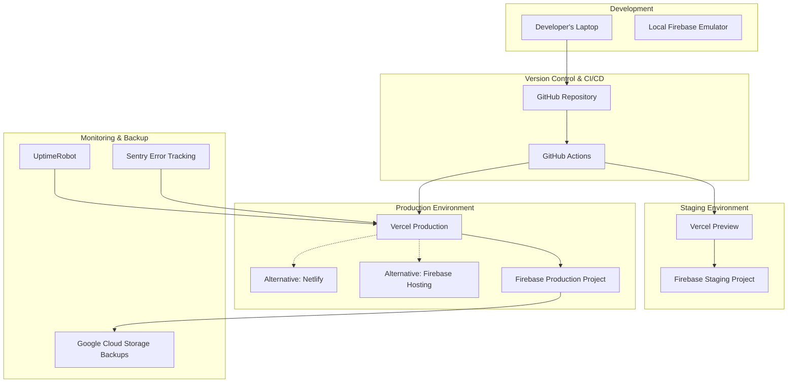
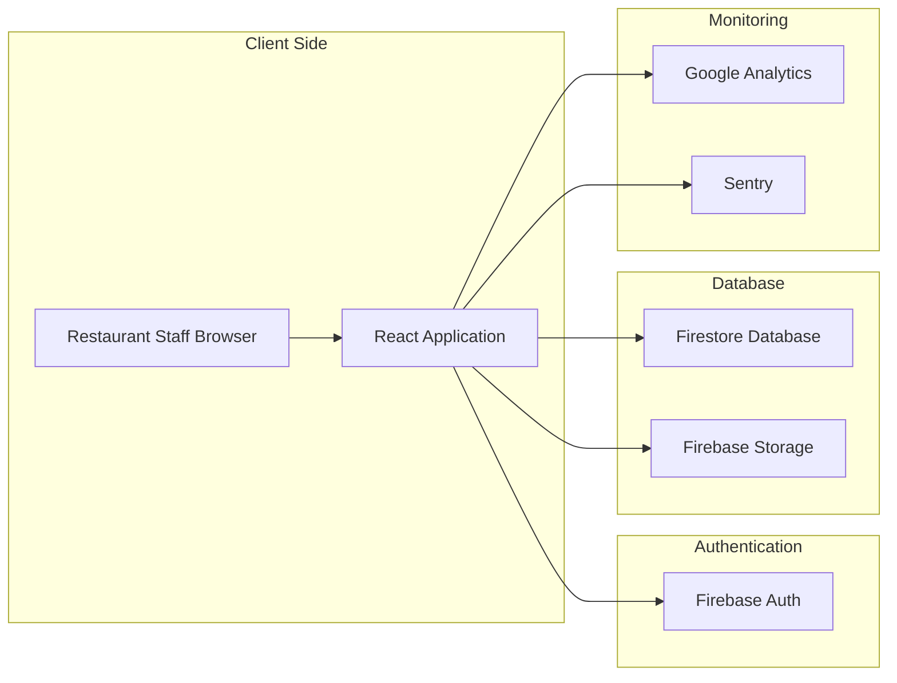

# **Deployment & Maintenance Plan: Mobilify Pro Admin Panel**

- **Document Version:** 2.0
- **Date:** January 27, 2025
- **Core Purpose:** To define the automated processes for releasing, monitoring, and maintaining the application, ensuring high availability and reliability.

### **1\. Deployment Strategy & Multi-Platform Configuration**

Our strategy leverages multiple deployment platforms for flexibility and redundancy, with Firebase projects configured for both staging and production environments.

#### **1.1 Firebase Project Configuration**

- **Production:** `mobilify-pro-admin` (existing project)
  - **Region:** europe-west1 (optimal for Egyptian market)
  - **Purpose:** Live application for paying restaurant clients
- **Staging:** `mobilify-staging` (to be created)
  - **Region:** europe-west1 (consistent with production)
  - **Purpose:** Testing environment for new features and UAT

#### **1.2 Deployment Platforms**

- **Primary Platform:** **Vercel** (existing account)
  - **Production URL:** `mobilify-admin.vercel.app` (default domain)
  - **Staging URL:** Auto-generated preview URLs for feature branches
  - **Reason:** Zero-configuration deployment, global CDN, automatic HTTPS

- **Alternative Platform 1:** **Firebase Hosting**
  - **Production URL:** `mobilify-pro-admin.web.app`
  - **Staging URL:** `mobilify-staging.web.app`
  - **Reason:** Direct integration with Firebase backend, custom domain support

- **Alternative Platform 2:** **Netlify**
  - **Production URL:** `mobilify-admin.netlify.app`
  - **Staging URL:** Auto-generated deploy previews
  - **Reason:** Excellent form handling, edge functions, branch deployments

#### **1.3 Source Control & Version Management**

- **Repository:** GitHub (existing)
- **Branch Strategy:**
  - `main` → Production deployments
  - `staging` → Staging environment testing
  - `feature/*` → Preview deployments for testing

### **2\. Environment Configuration**

#### **2.1 Environment Variables**

- **Production Environment (.env.production):**

```env
VITE_FIREBASE_API_KEY="AIza..."
VITE_FIREBASE_AUTH_DOMAIN="mobilify-pro-admin.firebaseapp.com"
VITE_FIREBASE_PROJECT_ID="mobilify-pro-admin"
VITE_FIREBASE_STORAGE_BUCKET="mobilify-pro-admin.appspot.com"
VITE_FIREBASE_MESSAGING_SENDER_ID="..."
VITE_FIREBASE_APP_ID="..."
VITE_APP_ENV="production"
VITE_APP_NAME="Mobilify Pro Admin Panel"
VITE_APP_VERSION="1.0.0"
```

- **Staging Environment (.env.staging):**

```env
VITE_FIREBASE_API_KEY="AIza..."
VITE_FIREBASE_AUTH_DOMAIN="mobilify-staging.firebaseapp.com"
VITE_FIREBASE_PROJECT_ID="mobilify-staging"
VITE_FIREBASE_STORAGE_BUCKET="mobilify-staging.appspot.com"
VITE_FIREBASE_MESSAGING_SENDER_ID="..."
VITE_FIREBASE_APP_ID="..."
VITE_APP_ENV="staging"
VITE_APP_NAME="Mobilify Pro Admin Panel (Staging)"
VITE_APP_VERSION="1.0.0-staging"
```

#### **2.2 Platform-Specific Configuration**

- **Vercel:** Environment variables managed through Vercel dashboard
- **Firebase Hosting:** Variables configured via Firebase CLI
- **Netlify:** Environment variables set in Netlify dashboard

### **3\. CI/CD Pipeline (Continuous Integration / Continuous Deployment)**

#### **3.1 GitHub Actions Workflow**

- **Automation Tool:** GitHub Actions (free tier)
- **Workflow Files:**
  - `.github/workflows/production.yml` - Production deployments
  - `.github/workflows/staging.yml` - Staging deployments
  - `.github/workflows/preview.yml` - Feature branch previews

#### **3.2 Production Pipeline (main branch)**

**Trigger:** Push to `main` branch
**Steps:**

1. **Checkout Code:** Latest version from main branch
2. **Setup Node.js:** Install Node.js 18.x
3. **Install Dependencies:** `npm ci` for faster, reliable installs
4. **Run Quality Checks:**
   - `npm run lint` (ESLint validation)
   - `npm run type-check` (TypeScript compilation)
   - `npm run test` (Unit and integration tests)
5. **Build Application:** `npm run build` (production optimization)
6. **Deploy to Multiple Platforms:**
   - **Primary:** Vercel (automatic via GitHub integration)
   - **Backup:** Firebase Hosting (manual trigger option)
   - **Alternative:** Netlify (manual trigger option)

#### **3.3 Staging Pipeline (staging branch)**

**Trigger:** Push to `staging` branch
**Steps:** Same as production but deploys to staging environments
**Purpose:** User Acceptance Testing (UAT) before production release

### **4\. Infrastructure Architecture**

#### **4.1 Multi-Environment Setup**



#### **4.2 Data Flow Architecture**



### **5\. Monitoring & Analytics Strategy**

#### **5.1 Comprehensive Monitoring Stack**

- **Uptime Monitoring:** **UptimeRobot** (Free Plan)
  - **Frequency:** Every 5 minutes
  - **Alerts:** Immediate email notifications for downtime
  - **Monitored URLs:**
    - Production: `mobilify-admin.vercel.app`
    - Staging: Auto-generated preview URLs

- **Error Tracking:** **Sentry** (Free Developer Plan)
  - **Real-time Error Capture:** JavaScript errors, performance issues
  - **User Context:** Error tracking with user session data
  - **Performance Monitoring:** Page load times, API response times
  - **Alerts:** Immediate notifications for critical errors

- **User Analytics:** **Google Analytics 4**
  - **User Behavior:** Page views, session duration, user flows
  - **Business Metrics:** Feature usage, conversion tracking
  - **Performance Insights:** Core Web Vitals, page speed metrics

- **Firebase Analytics:** **Firebase Analytics**
  - **Authentication Events:** Login success/failure rates
  - **Database Performance:** Read/write operation metrics
  - **Storage Usage:** File upload success rates

#### **5.2 Performance Monitoring**

- **Core Web Vitals Tracking:** Automated via Sentry and Google Analytics
- **Lighthouse CI:** Automated performance testing in GitHub Actions
- **Real User Monitoring (RUM):** Performance data from actual users
- **Alert Thresholds:**
  - Page load time > 3 seconds
  - Error rate > 1%
  - Uptime < 99.5%

### **6\. Backup & Disaster Recovery**

#### **6.1 Automated Backup Strategy**

- **Frequency:** Weekly automated backups (upgradeable to daily)
- **Tool:** Scheduled GitHub Action
- **Process:**
  1. GitHub Action triggers weekly (Sunday 2 AM UTC)
  2. Uses `gcloud` CLI to export Firestore database
  3. Saves backup to Google Cloud Storage bucket
  4. Retains backups for 90 days (configurable)
  5. Sends notification email on success/failure

#### **6.2 Backup Configuration**

```yaml
# .github/workflows/backup.yml
name: Weekly Database Backup
on:
  schedule:
    - cron: '0 2 * * 0' # Every Sunday at 2 AM UTC
  workflow_dispatch: # Manual trigger option

jobs:
  backup:
    runs-on: ubuntu-latest
    steps:
      - name: Export Firestore Database
        run: |
          gcloud firestore export gs://mobilify-backups/$(date +%Y-%m-%d)
      - name: Notify Success
        run: echo "Backup completed successfully"
```

#### **6.3 Disaster Recovery Plan**

- **RTO (Recovery Time Objective):** < 4 hours
- **RPO (Recovery Point Objective):** < 7 days (weekly backups)
- **Recovery Steps:**
  1. Assess damage scope
  2. Create new Firebase project if needed
  3. Restore from latest backup
  4. Update environment variables
  5. Redeploy application
  6. Verify functionality

### **7\. Rollback & Deployment Safety**

#### **7.1 Multi-Platform Rollback Procedures**

**Vercel Rollback:**

1. Access Vercel project dashboard
2. Navigate to "Deployments" tab
3. Find last stable deployment
4. Click "Promote to Production"
5. **Rollback Time:** < 30 seconds

**Firebase Hosting Rollback:**

```bash
firebase hosting:rollback
```

**Rollback Time:** < 2 minutes

**Netlify Rollback:**

1. Access Netlify site dashboard
2. Go to "Deploys" section
3. Find stable deployment
4. Click "Publish deploy"
5. **Rollback Time:** < 1 minute

#### **7.2 Deployment Safety Measures**

- **Atomic Deployments:** All platforms support atomic deployments
- **Blue-Green Deployment:** Staging environment for testing
- **Canary Releases:** Gradual rollout capability (future enhancement)
- **Health Checks:** Automated post-deployment verification

### **8\. Security & Compliance**

#### **8.1 Security Headers & CSP**

```javascript
// Security headers configuration
const securityHeaders = {
  'Content-Security-Policy':
    "default-src 'self'; script-src 'self' 'unsafe-inline' https://apis.google.com; style-src 'self' 'unsafe-inline' https://fonts.googleapis.com;",
  'X-Frame-Options': 'DENY',
  'X-Content-Type-Options': 'nosniff',
  'Referrer-Policy': 'strict-origin-when-cross-origin',
  'Permissions-Policy': 'camera=(), microphone=(), geolocation=()',
};
```

#### **8.2 Environment Security**

- **Environment Variables:** Secure storage in platform dashboards
- **API Keys:** Restricted to specific domains
- **Firebase Rules:** Production-ready security rules deployed
- **HTTPS Enforcement:** Automatic HTTPS on all platforms

### **9\. User Management Strategy**

#### **9.1 V1.0 User Management (Invitation-Only)**

- **Restaurant Onboarding:** Manual account creation via Firebase Console
- **User Creation Process:**
  1. Create restaurant document in Firestore
  2. Create user account in Firebase Auth
  3. Assign restaurant ownership
  4. Send login credentials securely
  5. Guide through initial setup

#### **9.2 Admin Tools (Firebase Console)**

- **User Management:** Firebase Auth console
- **Data Management:** Firestore console
- **Analytics:** Firebase Analytics dashboard
- **Security:** Security rules management
- **Monitoring:** Firebase performance monitoring

#### **9.3 Demo Account Setup**

- **Production Demo Account:**
  - Restaurant: "Demo Restaurant"
  - Email: demo@mobilifypro.com
  - Purpose: Sales demonstrations and safe testing
  - Data: Realistic but clearly marked as demo

### **10\. Maintenance & Updates**

#### **10.1 Dependency Management**

- **Dependabot:** Automated security updates
- **Monthly Reviews:** Manual dependency audits
- **Security Scanning:** GitHub security advisories
- **Update Strategy:** Test in staging before production

#### **10.2 Platform Maintenance**

- **Vercel:** Automatic platform updates
- **Firebase:** Managed service updates
- **Node.js:** LTS version updates quarterly
- **React:** Major version updates annually

#### **10.3 Performance Optimization**

- **Bundle Analysis:** Monthly bundle size reviews
- **Code Splitting:** Lazy loading implementation
- **CDN Optimization:** Automatic via Vercel Edge Network
- **Database Optimization:** Query performance monitoring
